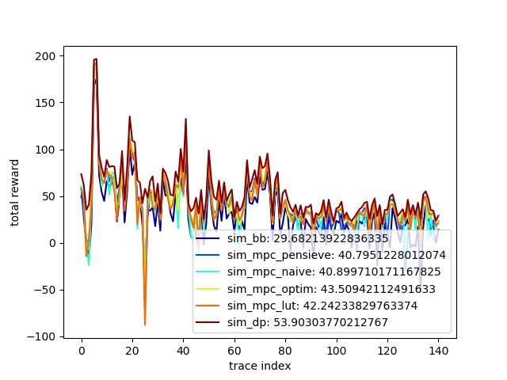
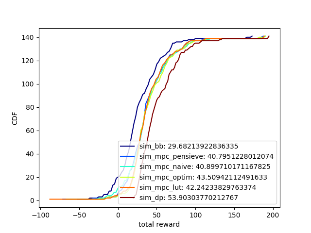

# Adaptive Video Streaming Lab （MPC Part）

​																	石弼钊 shi_bizhao@pku.edu.cn

## 代码库结构

### MPC方法

MPC基于代码库的基础代码文件：```fixed_env.py```、```load_trace.py```、```plot_results.py```、```get_video_sizes.py```。具体算法表述与功能实现的列表如下：

|   版本   |     代码文件名称      | 版本描述                                                     |
| :------: | :-------------------: | :----------------------------------------------------------- |
| Baseline | ```mpc_pensieve.py``` | 该文件移植自Pensieve项目中的```/test/mpc.py```文件，将基于Python2语法语句修改为Python3；并完成```get_video_sizes```函数返回值数量不匹配的bug修复。 |
| Ver. 1.0 |  ```mpc_naive.py```   | 该版本基于Baseline，对于每次添加的预测带宽值进行了修改，使其符合FMPC提到的实现策略。 |
| Ver. 1.1 |  ```mpc_optim.py```   | 该版本基于Ver. 1.0，对于枚举产生的解空间进行了精简，剔除部分抖动很大的解；同时去除掉之前版本中存在的```video_size```数组，使其进行预测时用到的未来片段信息完全来自于```get_video_sizes```函数的返回值，更加符合实际，也与其他方法得到信息一致；此外，还增加了计算结果复用方面的优化和最优解更新的策略。 |
|   None   |   ```gen_lut.py```    | 该文件将产生离线计算的场景对应解，生成的```enum.txt```或```enum_vec.txt```将作为查找表被FMPC的相关版本加载至内存并使用。 |
| Ver. 2.1 |   ```mpc_lut.py```    | 该版本基于Ver. 1.1，去除了在线枚举解并产生最优解的部分，使用```gen_lut.py```文件生成的```enum.txt```作为查找表，实际应用时将对应的信息离散化至对应的场景，查表直接得到输出，计算速度大幅提升。 |
| Ver. 2.2 | ```mpc_vec_lut.py```  | 该版本基于Ver. 2.1，使用```gen_lut.py```文件生成的```enum_vec.txt```作为查找表，实际应用时亦采用查找表的形式。该查找表目前为向量化的版本，故引入的额外内存开销明显小于Ver. 2.1。 |


## 运行方式

### MPC方法

- 首先生成环境基本参数：`python .\get_video_sizes.py`
- 对于pensieve作者给出的MPC算法，运行方式为：`py .\mpc_pensieve.py`
- 对于笔者实现的MPC方法，运行对应版本的py文件即可
- 确保在`/results/`文件夹中得到运行结果后，运行`py .\plots.py`获取可视化的运行结果。

## 原理简述

### MPC方法

本节中将介绍MPC方法的原理及其在动态自适应比特率选择问题中的应用。

MPC (Model Predictive Control)方法通过对问题建立可行有效的模型，构建合理的设计空间，并利用控制理论及线性规划的手段对于设计空间的最优解进行约束与表达。

在动态自适应比特率选择问题中，作者首先对于用户体验质量QoE(Quality-of-Experience)所考虑的因素构造出设计空间：视频片段码率选择的均值、相邻视频片段之间码率差异的平滑程度、缓冲区剩余时间与重缓冲事件。前两种因素是基于码率算法类所考虑的因素；后两者是基于缓冲区的算法类所考虑的因素。MPC方法可以视作以上两类算法的结合，采用模型控制理论和线性规划的方法也更加适合做到多因素的相互平衡并达到全局最优。

通过设定适当的参数，可以给出$QoE$的具体表达式如下：

$$QoE_1^K = \sum_{k=1}^Kq(R_k) - \lambda \sum_{k=1}^{K-1}|q(R_{k+1}) - q(R_k)| - \mu\sum_{k=1}^Kmax(\frac{d_k(R_k)}{C_k} - B_k,0) - \mu_sT_s$$ 

其中，$q(R_k)$代表比特率为$R_k$的视频片段的质量，在实现中可以约等于码率；第二项为相邻两片段间视频质量的差异，即表明了平滑程度，在实际应用中，最理想的情况即为一直保持最高码率，没有任何码率差异，即这一项对于总体的$QoE$有负面作用，所以其系数为$-\lambda$；第三项为在播放过程中不断下载的重缓冲时间，其中$d_k(R_k)$表示码率为$R_k$的这个视频片段的大小，而$C_k$代表此时的带宽，那么二者的商即代表了下载当前视频片段所需的时间，结合$B_k$，即当前剩余缓冲时间，若当前缓冲时间播放完毕后仍未等到下一个片段的下载，那么将造成一个重缓冲事件，这也是对于$QoE$有负面影响的。此外，在视频播放的初始阶段，一个启动时间的延迟也是对用户体验有负面影响的，但随着视频播放进入到稳定阶段，该项将从$QoE$的表达式中删去。

据此，作者给出了最优化QoE的开始阶段和稳定阶段的线性规划表述，如下：

$\ \ \ \ max  \ \ \ QoE_1^K   \ \ \ or \ \ \ QoE_n^{n+K-1}\\$  

$\ \ \ \ s.t. \ \ \ \ \ \ t_{k+1} = t_k + \frac{d_k(R_k)}{C_k} + \Delta t_k$ 

$\ \ \ \ C_k = \frac{1}{t_{k+1} - t_k -\Delta t_k}\int_{t_k}^{t_{k+1}-\Delta t_k}C_tdt$ 

$\ \ \ \ B_{k+1} = max(max(B_k -\frac{d_k(R_k)}{C_k}, 0) + L - \Delta t_k, 0)$ 

$ \ \ \ \ B_1 = T_s, \ \ \ \ B_k \in [0, B_{max}]$ 

$\ \ \ \ R_k\in R, \ \ \ \ \forall k = 1,...,K \ \ \ or \ \ \ n,...,n+K-1$ 

建立了上述的线性规划问题模型，我们需要利用这一模型，结合历史输入，对未来的码率选择进行预测。目前已有的信息包括历史的码率选择、当前的缓冲区大小，以及一个未来带宽预测器。将此部分信息作为$QoE$线性规划问题的初始，来计算未来一段时间达到最大$QoE$的解。

此外，论文中提到$QoE$将十分依赖于对于带宽的预测。而实际情况中，带宽的预测并不能准确，其大多只能给出一个大致的带宽区间，作者对此给出一个鲁棒的MPC，即其QoE的下限即为带宽下限取值时对应的结果。

由于解空间的大小随着考虑未来片段数和码率选择种类数而指数增加，作者提出离线计算，在线查表的策略，将指数时间复杂度将至O(1)复杂度。

## 所做改进

### MPC方法

本节主要讲述笔者在代码实现环节所进行的优化及其考虑。

（1）解空间精简优化：

运行Ver. 1.0和BB方法的结果比较，我们不难发现MPC相较于BB减少了很多相邻码率选择的抖动。则相应地，在枚举的过程中，带有剧烈抖动的解也大概率不会被作为最优解成为最终码率的选择。对此，笔者在此提出一种基于Hamming Distance的优化策略：

对于未来k个视频片段码率选择的解，若总共有M种码率可供选择，那么其形式可表征为：$(op_1,op_2, ...,op_k)$，其中$\forall op_i \isin 0,1,..,M-1$。定义临近Hamming Distance如下：

$Hamming \ Distance = \sum_{i=1}^{k-1}abs(op_{i+1} - op_{i})$

通过设定Hamming距离的阈值，我们可以将大于此阈值的解从解空间中剔除。

在本实验环境下，考虑未来5个视频片段，每个视频片段有6种码率选择，则原始解空间大小为$6^5 = 7776$。

通过设定不同的Hamming距离阈值，我们可以在不同程度上精简解空间，精简比率如下：

| Threshold |  4   |  5   |  6   |  7   |  8   |  9   |
| :-------: | :--: | :--: | :--: | :--: | :--: | :--: |
| #Solution | 4248 | 4604 | 5052 | 5540 | 6056 | 6516 |
| Ratio(%)  | 54.6 | 59.2 | 64.9 | 71.2 | 77.9 | 83.7 |

最终笔者选取7作为阈值，实现29%左右的计算量优化。

（2）查找表构建因素修改：

在FMPC的文章中，作者构建查找表的场景依据：当前缓冲区尺寸BufferSizeLevel、当前码率选择BitrateOption、未来带宽预测。笔者在实现中梳理未来预测带宽对QoE的影响逻辑：首先将结合码率选择对应的视频片段尺寸共同影响下载时间，进而影响缓冲区的尺寸和重缓冲。此外，笔者发现在给定的若干种码率选择中，视频片段尺寸和码率值基本遵守正比关系，即$Chunk \ Size \propto Bitrate \  Value$。那么我们可以以最小码率的下载时间MinDownloadTime作为基准，合并未来带宽预测和未来视频尺寸这两个变量，并以正比关系推测其他码率的下载时间。进而构建一个三因素的场景如下，边界值与步长根据经验确定：

| 因素             | 量纲 | 最小值 | 最大值 | 步长 |
| ---------------- | ---- | ------ | ------ | ---- |
| BufferSizeLevel  | s    | 1.0    | 30.0   | 1.0  |
| BitrateOption    | None | 0      | 5      | 1    |
| MiniDownloadTime | s    | 0.04   | 4.00   | 0.04 |

最终构建了共18000个场景，构建的查找表文件，若使用按字节存储，理论最小值为18KB。


## 实验结果

### MPC方法

Reward效果比较sim_dp, sim_mpc_pensieve, sim_mpc_naive, sim_mpc_optim, sim_mpc_lut, sim_bb：



累积分布函数CDF曲线如下：




由于笔者电脑上没有安装tf环境，按照同学跑出的结果，MPC方法的相关指标已经超过了Pensieve方法。

运行时间比较：

|     版本     | BB方法 | Baseline | Ver. 1.0 | Ver. 1.1 | Ver. 2.0 |
| :----------: | :----: | :------: | :------: | :------: | :------: |
| **运行时间** | 0.54s  | 403.82s  | 404.75s  | 244.91s  |  0.76s   |

